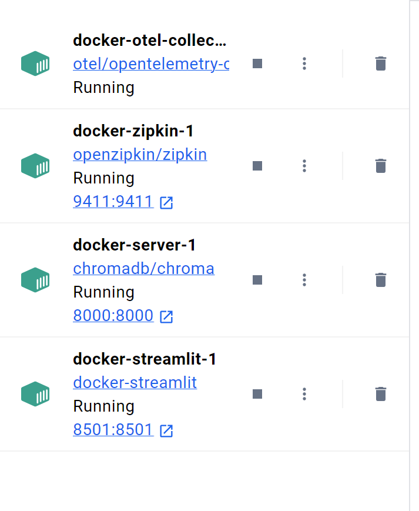
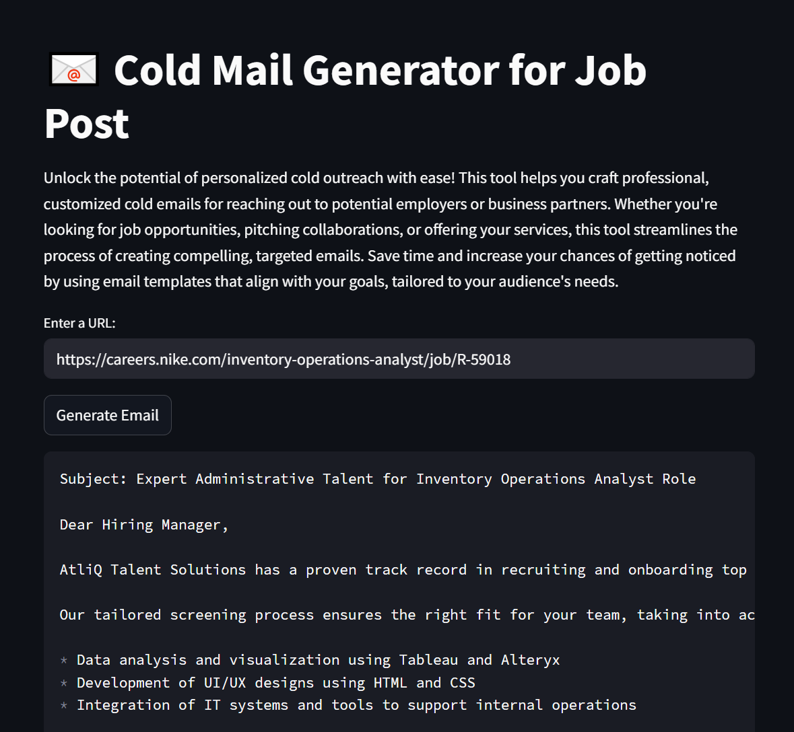

# 📧Cold Mail Generator for Job Post📧

## Overview

This project is designed to simplify the process of crafting personalized cold emails for job applicants or business partnerships. The system is built using **Streamlit** for the user interface, **LangChain** for advanced language models and chaining logic, and **ChromaDB** as vector database for managing a dynamic portfolio of skill-related links. The application helps users extract relevant job data from job listing websites and generate professional emails tailored to job positions.

## Tech Stack

### 1. **Streamlit**
Streamlit is used for building the interactive web application that allows users to input URLs of job listings, generate cold emails, and display the results in a simple and user-friendly manner. The application allows users to input job listing URLs (e.g., Nike job postings) and generates a cold email based on the job description and required skills.

### 2. **LangChain**
LangChain is a powerful tool that enables the chaining of multiple natural language processing (NLP) tasks. This is used to:
   - **Extract job information**: LangChain processes scraped job data (from websites like Nike’s career page) and extracts key details such as the role, experience required, skills, and job description.
   - **Write cold emails**: After extracting job details, LangChain is used to generate professional cold emails tailored to the job description. The emails are composed with a focus on highlighting relevant portfolio items based on job requirements.

### 3. **ChromaDB**
ChromaDB as vector database is utilized to store and query relevant portfolio items linked to specific skills. It allows the system to efficiently match job skills with portfolio links (e.g., links to a user’s past work, case studies, etc.). The portfolio data is stored in a CSV file and loaded into the database at runtime.

### 4. **ChatGroq**
ChatGroq is an advanced large language model (LLM) developed by Groq, designed to optimize AI workloads with impressive computational performance. It is capable of handling complex natural language processing (NLP) tasks, including text generation, summarization, classification, and extraction. ChatGroq uses a highly efficient hardware architecture, making it faster and more cost-effective for various machine learning tasks, especially in large-scale applications.

### 5. **Python Libraries**
The project leverages various Python libraries such as:
   - **Pandas** for managing portfolio data.
   - **UUID** for generating unique identifiers.
   - **Logging** for tracking the flow and errors in the system.

### 6. **Docker**
Docker is used to package the entire application (Python code, libraries, environment settings) into containers. This makes the app portable, consistent, and easy to deploy anywhere without worrying about "it works on my machine" problems. Docker Compose is used to define and run multi-container applications easily. Here's all the containers: 

## Streamlit UI

## Architecture

The architecture consists of three main components:

1. **Web Scraping (Data Extraction)**:
   - The **WebBaseLoader** component from LangChain is used to load job listing pages from user-inputted URLs.
   - The job data is then cleaned using a text cleaning function (`clean_text`) to remove unwanted characters and formatting issues.
   - The cleaned data is passed to the **LangChain** model, which extracts structured job information such as the role, experience, skills, and job description.

2. **Portfolio Matching (ChromaDB)**:
   - The portfolio data (stored in a CSV file) is loaded into **ChromaDB** for easy querying.
   - When a job listing is processed, the system queries the ChromaDB collection to find portfolio items related to the required skills. This is done using the **query_links** function, which matches the required skills with portfolio items in the database.
   - ChromaDB enables fast retrieval and dynamic portfolio management.

3. **Email Generation (LangChain + LLM)**:
   - After extracting the job data and querying the portfolio, the system uses **LangChain** with ChatGroq to generate a professional cold email.
   - The email emphasizes the candidate's relevant experience and portfolio, tailored to the job description and skills extracted from the job listing.
   - The generated email is displayed in the Streamlit app as a markdown code block for easy copying.

## Workflow

1. **User Input**: The user provides a job listing URL (e.g., a Nike job posting) through a simple text input field in the Streamlit app.
   
2. **Job Data Extraction**: The URL is processed by the **WebBaseLoader**, which scrapes the webpage content. The extracted text is cleaned using the `clean_text` function to ensure proper formatting.

3. **Portfolio Matching**: The job’s required skills are passed to ChromaDB, where the portfolio links matching those skills are retrieved.

4. **Email Generation**: Using the extracted job details and portfolio links, LangChain’s **LLM** generates a tailored cold email, which is displayed in the Streamlit interface.

5. **Output**: The system outputs the cold email as a markdown-formatted code block that the user can copy and send.

## Impact

This application significantly enhances the process of personalized cold emailing, reducing manual effort and increasing the likelihood of getting noticed by potential employers or clients. By automating the extraction of relevant job data and dynamically generating targeted emails based on the user's portfolio, it enables more professional and efficient outreach.

### Key Benefits:
1. **Personalization at Scale**: The application allows users to generate tailored cold emails based on specific job descriptions, making the outreach more relevant and impactful.
2. **Time Efficiency**: By automating the extraction and email composition process, users save time that would otherwise be spent on manually crafting each email.
3. **Increased Engagement**: Customized cold emails that highlight a candidate’s most relevant skills and portfolio items are more likely to grab the attention of hiring managers or business partners.
4. **Data-Driven Portfolio Matching**: By leveraging ChromaDB for portfolio data management and querying, the system ensures that the most relevant portfolio items are presented to potential employers based on the job’s requirements.

## Future Enhancements

1. **Extended Portfolio Matching**: Integrating more advanced portfolio matching algorithms that not only consider skills but also experience, job requirements, and geographic location.
   
2. **Multi-Job Processing**: The system could be extended to handle multiple job listings at once, making it suitable for job seekers applying to various positions in parallel.

3. **User Profiles**: Adding a user profile system to store and track different users’ portfolios and preferences, allowing them to generate tailored cold emails for multiple job listings over time.

4. **Integration with Job Portals**: Extending the tool’s capabilities to directly pull job listings from APIs or integrations with popular job portals like LinkedIn, Indeed, or Glassdoor (subject to legal and ethical considerations).

## Conclusion

This Cold Mail Generator for Job Post is a powerful, automated tool that simplifies the process of reaching out to potential employers. By combining the power of **LangChain**, **Streamlit**, **ChromaDB**, and **ChatGroq**, it ensures that users can craft personalized, effective cold emails quickly and efficiently, increasing their chances of success in job applications or business collaborations.